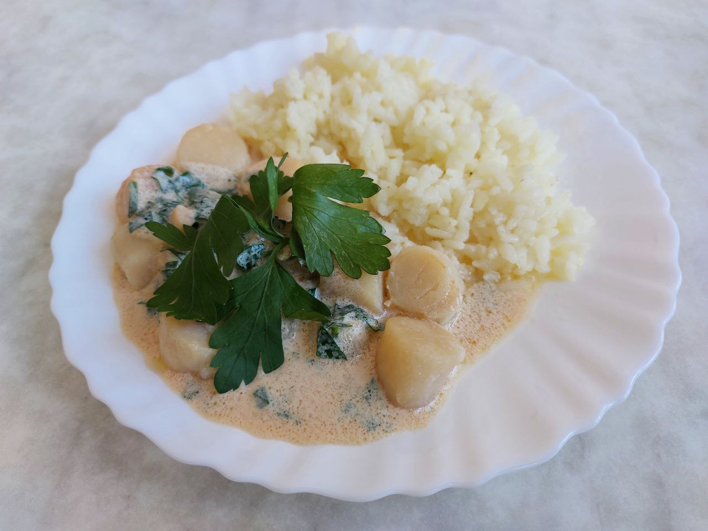

# Гребешки жареные с корочкой под чесночно-сливочным соусом

## Ингредиенты
* Гребешки ~ 300 г.
* Сливки = 150 мл.
* Масло сливочное = 30г. (1/5 пачки 180г)
* Чеснок = 3 зубка = 1 ст.л. с г.
* Петрушка, мелко нарубленная = 1 ст.л.
* Масло подсолнечное = 1-2 ст.л
* Соль (1щ)
* Перец черный молотый (1щ)

## Процесс приготовления
* Разморозить и просушить гребешки бумажной салфеткой.
* Мелко нарезать чеснок и петрушку.
* В сковороде разогреть подсолнечное масло (до дымка)
* Выложить (1 слоем) в сковороду гребешки, и жарить не трогая их 2 мин.
* Перевернуть гребешки и добавить сливочное масло, и жарить не трогая их 1-2 мин. (зависит от толщины гребешков)
* гребешки выложить в тарелку, уменьшить нагрев, на оставшемся в сковороде масле обжарить чеснок 2 мин. (до лёгкой золотистости)
* добавить сливки и загустить их, интенсивно помешивая
* добавить петрушку и черный перец
* выключить нагрев, соус готов.

## Подача
* В тарелку налить соус. В него выложить гребешки корочкой вверх. Посыпать свежей зеленью петрушки. На гарнир рис.