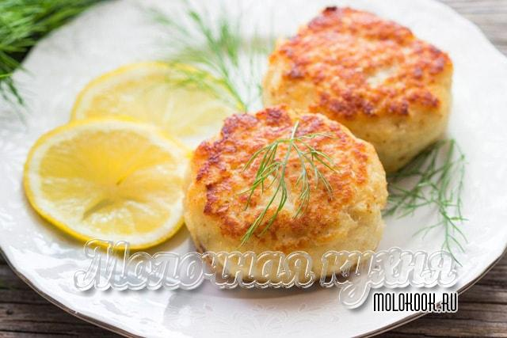

> TODO
# Котлеты из кальмара в духовке

## Ингредиенты
* кальмары – 400-500 г (вес уже подготовленного продукта);
* яйцо куриное (отборной категории) – 1 шт.;
* белый хлеб (батон), без корочек – 3 ломтика;
* молоко (можно заменить водой) – 50 мл;
* репчатый лук – 1 шт. (средней величины);
* соль поваренная – 1 ч. л. (без горки);
* перец черный (или смесь нескольких видов) – щепотка;
* панировочные сухари – 1-2 ст. л.;
* масло растительное – для смазывания противня, 1 ст. л.

## Приготовление
* Хлеб залить молоком и оставить при комнатной температуре до впитывания жидкости.
Если нет молока, можно использовать питьевую воду. Лук очистить.
Кальмары зачистить от пленок и внутренностей.
Пропустить их через мясорубку, установив мелкоячеистую решетку (если такой нет, перекрутить фарш дважды).
Затем то же самое сделать с хлебом и луком. В получившийся нежный фарш добавить яйцо, соль, перец.

* Добавить замоченный ранее хлебный мякиш, хорошо вымешать. Накрыть миску пленкой и поставить в холодильник на 40-50 минут.

* Если после "отдыха" фарш получится недостаточно густым, добавить немного панировочных сухарей и перемешать снова.

* Противень или жароупорную форму для выпекания смазать небольшим количеством масла.
Сформировать небольшие котлеты и выложить их на небольшом расстоянии друг от друга.
Запекать в разогретой до 180 градусов духовке в течение 20-25 минут, до образования румяной корочки сверху.

> В фарш можно добавить 100-150 г твердого сыра, нарезанного небольшими кубиками – получится еще вкуснее.

## Подача
* Салат переложить в ёмкость для подачи.

## Ссылки
* [Котлеты из кальмаров](https://www.youtube.com/watch?v=nNDYXUtKdwE)