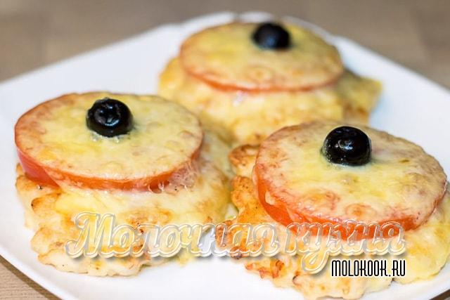

> TODO
# Котлеты из рубленного куриного филе с помидорами и сыром в духовке

## Ингредиенты

* куриная грудка (0.5 кг)
* чеснок (2 зубчика свежего или 2 щепотоки сушеного)
* крахмал (2 ст. л.)
* сметана или майонез (2 ст. л.)
* укроп (половина среднего пучка)
* яйцо (1 шт.)
* масло растительное – для смазывания противня;
* помидоры (1-2 шт.)
* твердый сыр (100-120 г.)
* соль, перец (по вкусу)

## Приготовление

* Мелко порубить грудку. Кусочки могут быть произвольной формы, здесь главное - размер.
* Зелень покрошить ножом, помидоры нарезать кружочками, а сыр натереть на крупной терке.
* Смешать курицу и укроп во вместительной посуде.
* Добавить туда же яйцо, сметану, крахмал. Посолить, поперчить.
* Перемешать и поставить миску в холодильник примерно на 1 час.
* Сформировать небольшие биточки, смачивая руки в холодной воде.
* Выложить заготовки на противень, смазанный маслом. На каждую котлету положить по 1-2 кружочка помидора, посыпать сыром.
* Разогреть духовку на 220 градусов. Запекать 10 минут.
* Снизить нагрев до 180 градусов. Продолжать готовить еще около 10 минут.

## Подача
Можно подавать котлеты в сопровождении любого гарнира. Кусочки помидора и сырная "шапочка" сделают их просто потрясающими.

## Ссылки
* [Рубленные котлеты из куриной грудки (филе) - самые вкусные рецепты](https://molokook.ru/rublenye-kotlety-iz-kurinoj-grudki-file/)