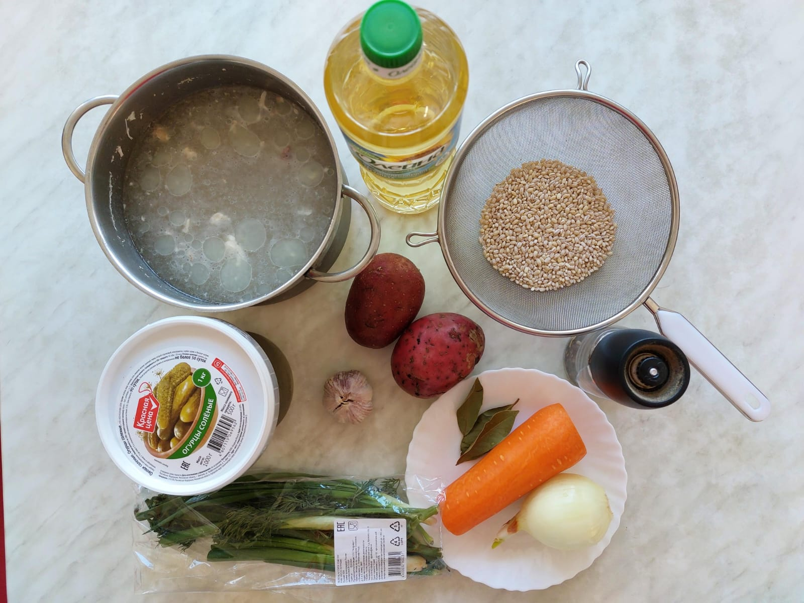

# Рассольник

(классический рецепт + ст.ложка томатной пасты)

## Ингидиенты

* Бульён с мелко нарезаным мясом - 2 л.
* Огурцы солёные (без уксуса) - 6 шт.
* Картофель - 1-2 шт.
* Морковь - 1-2 шт.
* Лук репчатый луковица - 1 шт.
* Перловка - 90 г. (0.5 мультиварочного ст.)
* Чеснок - 4-5 зуб.
* Лавровый лист - 1-3 шт.
* Перец душистый (горошек) - 5-6 шт.
* Масло подсолнечное (для жарки)
* Томатная паста (по желанию) - 1 ст.л.

## Приготовление

### Варим перловку

* Замачиваем перловку в кипятке на 5 мин.
* Варим перловку в мультиварке на режиме "Гречка" или в отдельной кастрюле.

### Варим картофель

* В бульён кладём лавровый лист и перец, кипятим.
* Картофель режем кубиками по 1 см.
* Кладём в бульён и варим до готовности.

### Делаем прижарку

* Режем мелко лук
* Морковь трём на терке
* Обжариваем лук и морковь на масле
* Трём огурцы на тёрке
* Добавляем к моркови и луку
* Добавляем томатную пасту
* Пол стакана воды

### Сборка

* Как картофель перловка  и прижарка будут готовы
* Всё соединяем и варим 5-6 мин.
* Добавляем чеснок (черз чеснокодавку) и мелконарезанную зелень
* Выключаем, даем настоятся 5-10 мин.

