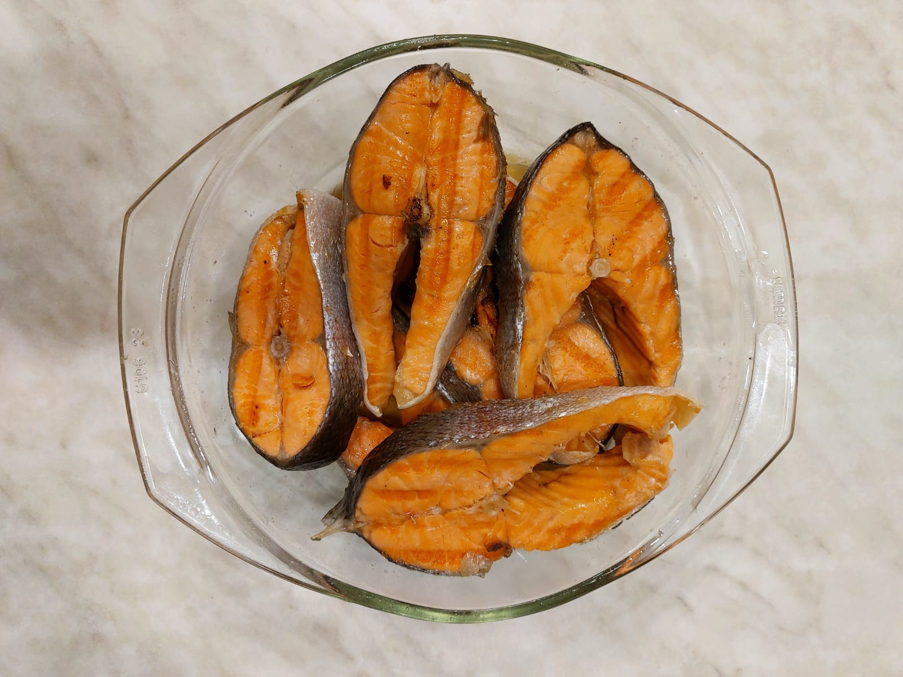

# Рыба на гриле

## Ингредиенты

* Красная рыба (форель, сёмга) - 1 шт.
* Соль - 1 ст.л. (с горкой)
* Сахар - 1 ст.л. (с горкой)
* Вода - 0.5 л.
* Масло подсолнечное
* Хлеб (батон из мягкого теста) - 6 кусочков (опционально)

## Приготовление

* Рыбу режем на порционные кусочки (толщиной 1.5-2см.)
* Растворяем соль и сахар в воде.
* Плотно укладываем в раствор рыбу, если раствора не достаточно для полного погружения рыбы, разводим ещё и доливаем.
* Даём рыбе постоять в растворе от 20 мин. до 1 часа
* Достаём рыбу просушиваем бумажными полотенцами.
* Намазываем срезы рыбы маслом (чтоб рыба не пригорала)
* Разогреваем электро гриль до максимальной температуры и кладём в него рыбу.
* Через 2 мин. переворачиваем кусочки рыбы
* И готовим до готовности (до температуры 58 градусов Цельсия в центе кусочка рыбы, определяется термощупом)
* Рыбу перекладываем в стеклянную ёмкость с крышкой и даём ей отдохнуть 10 мин.

## Хлеб (опционально)

* На оставшемся с рыбы масле жарим кусочки тонко нарезанного хлеба
* Хлеб выкладываем на решетку для остывания 10 мин.
