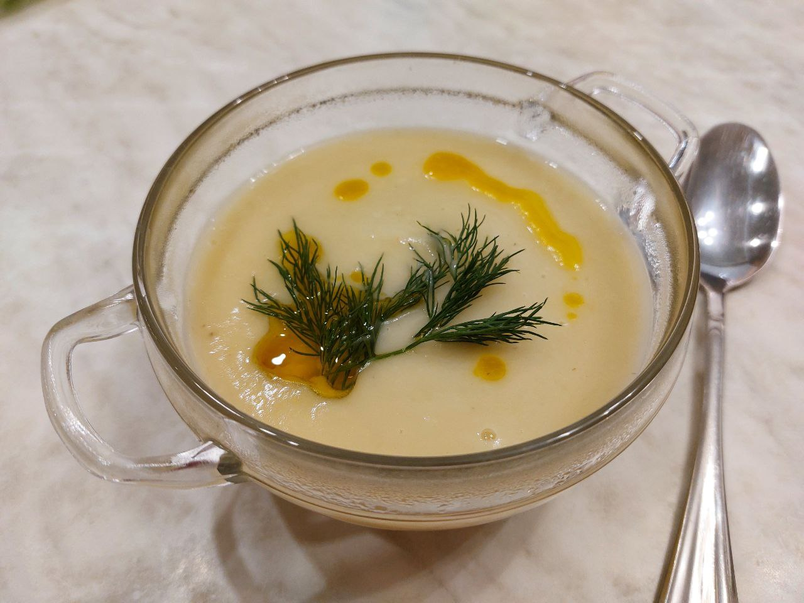
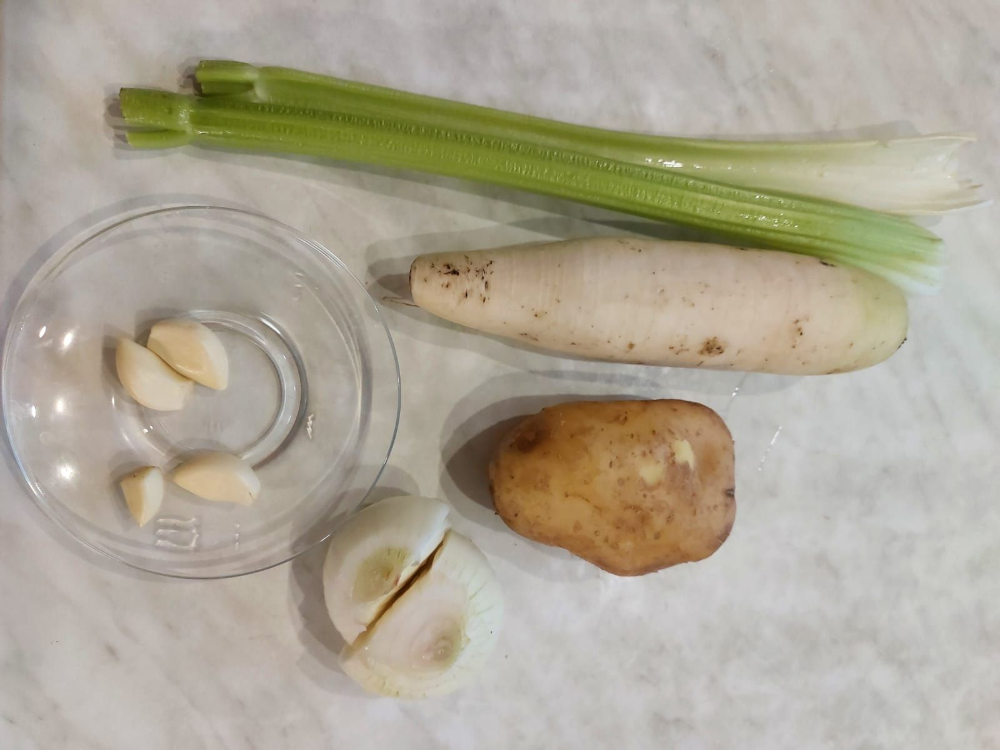
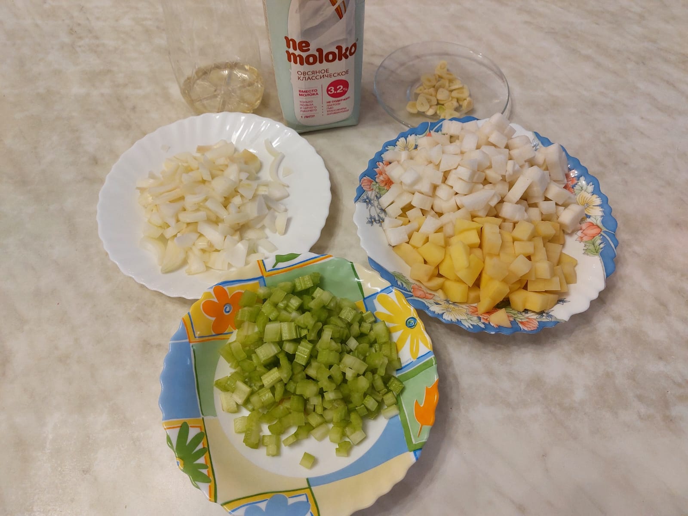
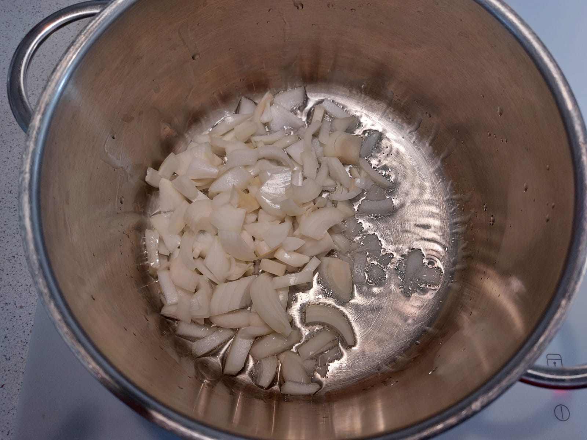
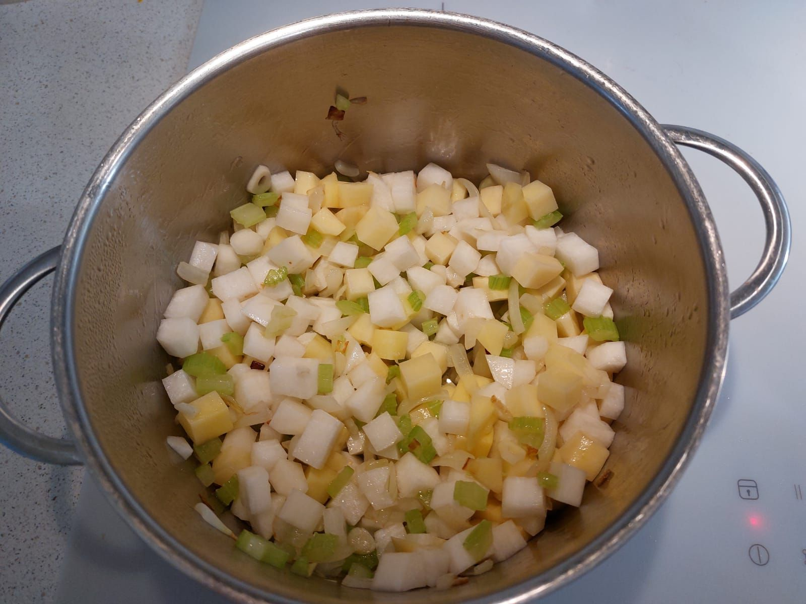
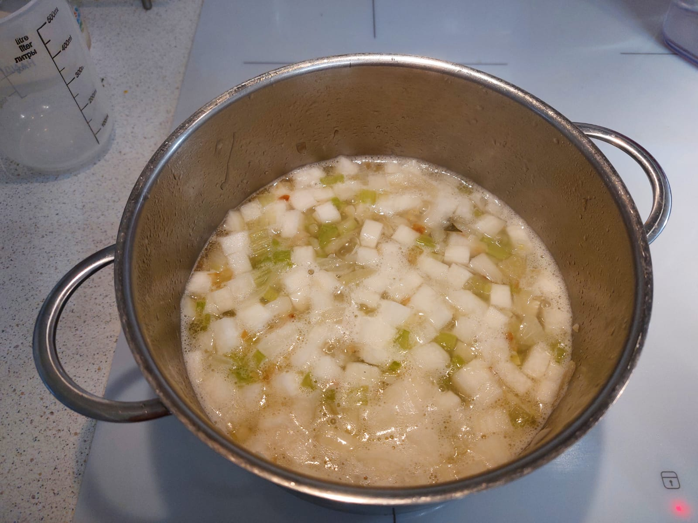
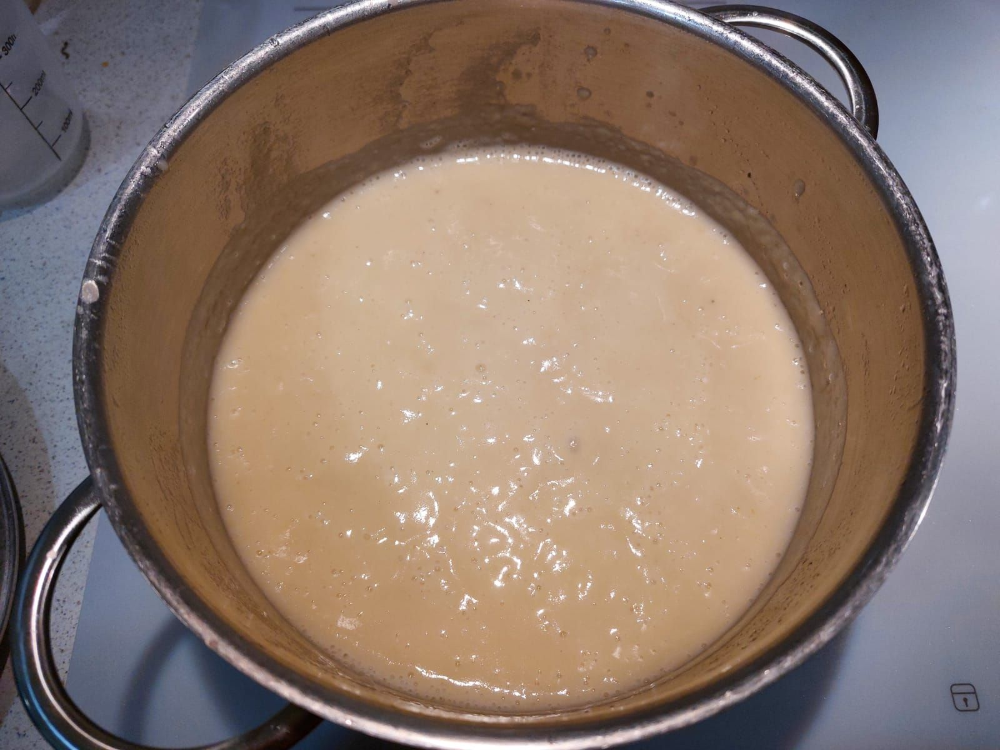

# Суп из редьки

## Ингредиенты

* редька дайкон (1 корень) - 2 части
* картофель (1 клубень) - 1 часть
* лук репчатый (1 луковица) - 1 часть
* сельдерей стеблевой (2 стебля) - 0.5 части
* вода - 500 мл.
* молоко (не молоко) - 200 мл (1 стакан).
* чеснок - 4 зуб.
* масло растительное - для жарки
* соль - по вкусу

## Приготовление

* Нарезаем овощи кубиками

* Жарим лук

* Добавляем другие овощи и тоже обжариваем

* Добавляем воду и варим 20 мин. после закипания

* Добавляем молоко и варим 5 мин. после закипания
* Взбиваем блендером до однородной массы

* Перекладываем в тару для подачи.
