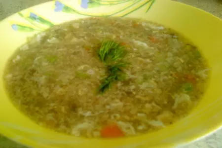

# Супчик "три пользы"

## Ингредиенты

* льняная мука 1 ст.л.
* картошка небольшая - 1шт
* половинка репчатого лука
* маленькая морковка или половинка боьшой
* половинка маленького кабачка
* яйцо куриное 1 шт
* приправы , соль (у меня смесь кореньев - пастернак,сельдерей, корень петрушки)

## Приготовление

* Столовую ложку муки разводим водой до консистенции густой сметаны.
* Овощи мелко режем, отправляем в кипящую воду. Даем покипеть минут 10.
* Берем сырое яйцо, разбиваем в слабо кипящий овощной бульон и быстро-быстро размешиваем. Должны получиться мягкие хлопья.
* Вслед за этим вливаем в бульон замоченную муку, помешиваем.
* Даем покипеть 1-2 мин, солим, добавляем приправы.

## Ссылки

* [Супчик "три пользы"](https://www.koolinar.ru/recipe/view/77441)

