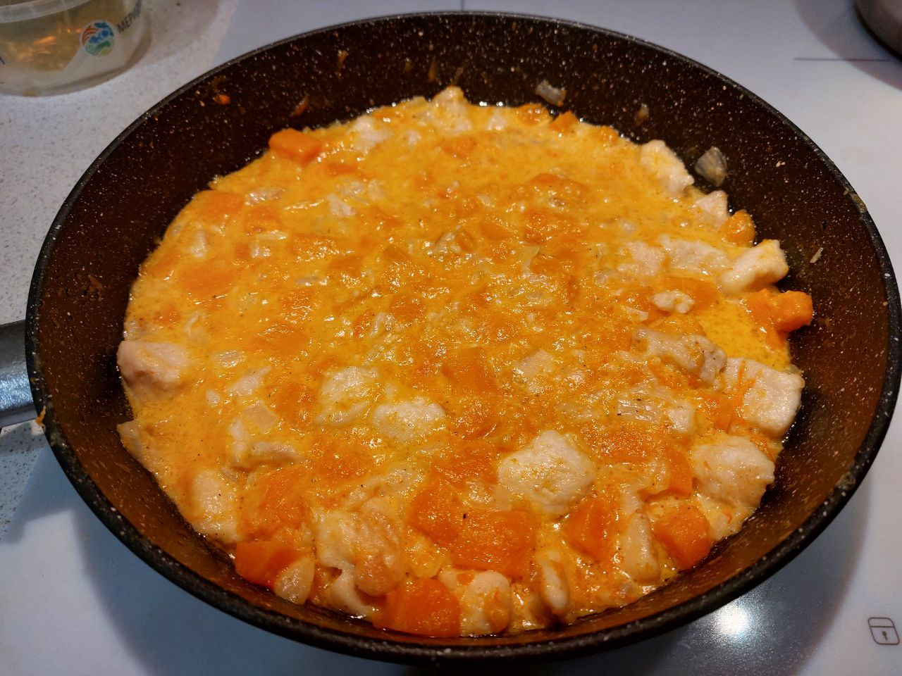

# Тушеная куриная грудка с тыквой

## Ингредиенты

* куриная грудка - 200 г.
* тыква - 400 г.
* репчатый лук (средняя луковица) - 1 шт.
* сыр (российский) - 50 г.
* вода - 50-100 гр.
* сметана - 2 ст.л. (с горкой)
* чеснок - 4 зубка.
* темпура (смесь 1:1 крахмал с мукой) - 2 ст.л.
* масло растительное для жарки - 3-4 ст.л.
* приправа Хмели-цунели - 1 ч.л.
* соль - по вкусу
* перец черный молотый - по вкусу

## Приготовление

* Режем куриную грудку кубиком 1.5 см.
* Режем лук любым удобным для жарки способом.
* Чистим и режем тыкву кубиками 1.5 см.
* Сыр трём на мелкую тёрку, перемешиваем с чесноком выдавленным через чеснокодавку, приправой, сметаной и водой. Водой регулируем консистенцию.
* Обваливаем курицу в темпуре. Выкладываем на разогретую сковороду с маслом и обжариваем до золотистой корочки 3-5 мин на сильном огне.
* Добавляем в сковороду лук и жарим ещё несколько минут.
* Добавляем в сковороду тыкву, заливаем смесью с сыром, сметаной и водой. Дожидаемся закипания,
уменьшаем огонь до минимального, накрываем сковороду крышкой и тушим 15-20 мин.
* Контролируем мягкость тыквы, солим, перчим, выключаем огонь.
* в процессе тушения крышкой регулируем консистенцию жидкости.

## Ссылки

Ниже ссылки на похожие рецепты. Отличие этой версии в запечатывании курицы темпурой/кляром при обжарке.
А при тушении темпура размокает и придаёт соусу приятную густоту и обволакиваемость продуктов (не стекает с кусочков мяса).

* [Курица, тушенная с тыквой и сметаной](https://www.russianfood.com/recipes/recipe.php?rid=164660)
* [Куриное филе с тыквой на сковороде](https://rutxt.ru/node/15320?ysclid=m1430c4alq856672779)
