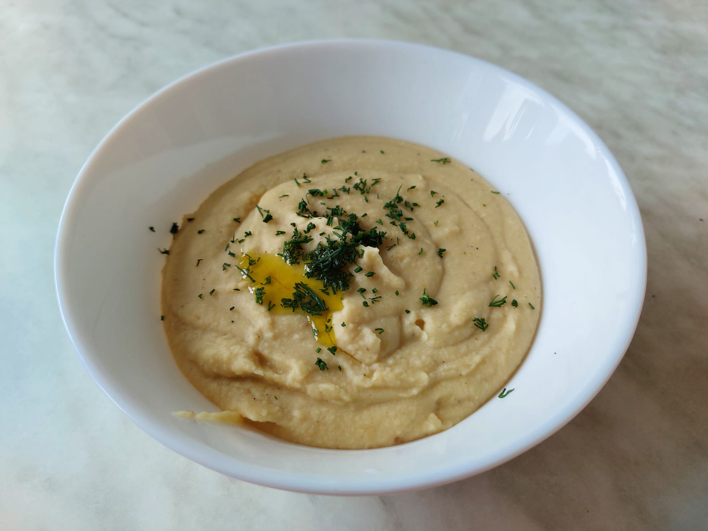

# Хумус (гороховое пюре)

## Ингредиенты

* горох (половинки или колотый) - 200гр.
* масло растительное - 6 ст.л.
* сок лайма (лайм 1 шт.) - 2 ст.л.
* чеснок - 2 зуб.
* приправа для плова (зира, семена кориандра, куркума) - 1 ч.л.
* соль - по вкусу

## Приготовление

* Варим горох до готовности. Время приготовления около 1 часа. В процессе меняем воду 2 раза через 15 минут после закипания.
* Перетираем в кофемолке или в ступке приправу и соль.
* Сливаем часть воды с гороха.
* Добавляем в горох приправу с солью, масло и сок лайма.
* Взбиваем пюре до однородной массы при необходимости добавляя слитую воду.
* Перекладываем пюре в тару для подачи.
