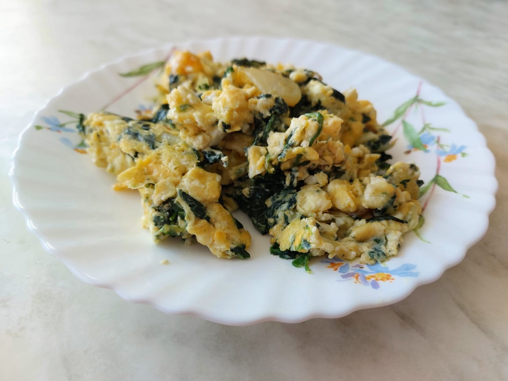

# Яичница со шпинатом

## Ингридиенты

* шпинат замороженный - 200гр.
* яйца куриные - 4 шт.
* лук репчатый  - 1 луковица
* чеснок - 1 зуб.
* масло растительное - для жарки.
* соль - по вкусу

## Приготовление

* жарим лук.
* размораживаем шпинат в микроволновке.
* добавляем шпинат к луку, жарим до исчезновения влаги.
* вливаем перемешанные яйца и чеснок через чеснокодавку.
* Перекладываем в тару для подачи.
